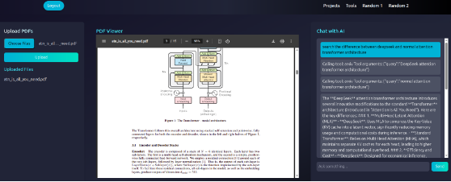
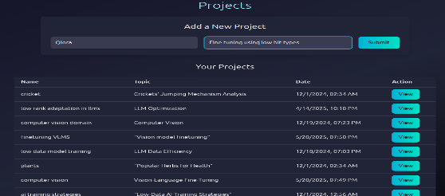

# AI-Based Research Assistant

This is an AI-based research assistant project by a solo developer (MSc in Data Science at TU Braunschweig) (ongoing 1st semester). The project is designed to help users with complex research tasks, using state-of-the-art AI models and technologies. 

### It is currently ongoing, with integration tasks still to be completed. Due to upcoming exams, active development is paused.

---

## Check out a demo video

Click on the below image, or follow this link: https://youtu.be/C5fS85VSZ6A

---

# NOTES:
## **Pending Integration**

- **Vision Models**: Vision models will be used in the future, along with text embedding, to improve the research process (e.g., using a Vision Transformer for image embedding).
- **Error handling in agents**: Handling cases where agent's process crashes due to any error.

##### Except complete_graph.py, extras.ipynb and extras dir, every other .py file has necessary functional code and all are important. (LOCATION: /api/)
---

## **Project Overview**

This research assistant leverages various AI technologies to support research tasks such as web searches, paper retrieval, summarization, Python code generation, and more.

### **Technologies Used**
- **LLama-3.3-70B-Versatile** $ **DeepSeek**
- **LangGraph**
- **LangChain**
- **RedisDB**
- **QdrantDB**

---

## **Team Structure**

- **Supervisor**: Oversees the entire process, analyzing queries, and delegating tasks across different teams.
- **LLM (Large Language Model) Team**: Handles general or casual queries.
- **Planner Agent Team**: Generates step-by-step plans to address complex user queries without observation.
- **Documentation Team**: Creates and updates .txt files, outlines, and necessary data. This team is responsible for summarization and report creation.

**Not integrated yet, however a fully working graph is present if we decide to integrate. The graph follows ReWoo Architecture (Reasoning Without Observation): (https://arxiv.org/abs/2305.18323)**

---

### **Pending Teams**

1. **Talk with Data Team**: Manages .csv, .excel, and other file-based data (potential use of vision models or image embedding).
2. **Researcher Team**: Multi-agent collaboration to research topics.
3. **Math Agent**: Tackle math problems, visualizations, and concepts like level sets, feasible regions, and gradients.

---

## **Backend**

- **Framework**: FastAPI (chosen for its performance and scalability)
- **Database**:
  - **QdrantDB**: For vector storage and retrieval of embeddings.
  - **RedisDB**: For managing conversation history and agent memory.
  - **SQLite**: Temporarily used for storing user authentication data (passwords are hashed).

---

## **Frontend**

- **Framework**: Next.js (Basic knowledge, but ongoing development)
- **Features**:
  - User authentication and routing.
  - Real-time chat updates using WebSocket.
  - File upload and display to facilitate research and conversation history tracking.

---

## **Implemented Features**

### **Agent Tasks**
1. **Web Search**: Searches the web for relevant information based on user queries.
2. **ArXiv Papers Search**: Retrieves academic papers from ArXiv.
3. **Retrieval-Augmented Generation**: Uses a self-query agent to retrieve and generate information.
4. **Internet Search**: Similar to web search but broader in scope.
5. **Python Code Tool**: Executes Python code for visualizations, math explanations, etc.
6. **Memory Update**: Remembers or updates specific information for future use based on user instructions.

### **Database Tasks**
1. **Vector Embedding Storage**: Creates and stores vector embeddings in Qdrant Cloud DB.
2. **PDF Storage**: Stores PDFs in a file system based on `api/users_storage/__userID__/__ConversationID__` directory structure.
3. **PDF Associations**: Tracks which PDFs are associated with which ConversationIDs in RedisDB.
4. **Structured Output Extraction**: Extracts structured output from PDFs, including title, authors, and description.
5. **Agent Memory Injection**: Injects PDFs into agent memory to make them accessible for relevant tasks.

### **Overall Flow**
1. **Supervisor**: The supervisor is responsible for analyzing queries and delegating tasks across the teams. The supervisor also plans the delegation order (e.g., for researching positrons: `{'LLM': 'General info on positron', 'ResearcherTeam': 'Recent research on positrons'}`).
2. **Researcher Team**: This team has several agents that collaborate. A planner agent organizes the research process, the tasks in the given plan are executed, and the results are summarized for the user.
3. **Documentation Team**: This team consists of agents that determine the best approach for each state of the task (e.g., summarizing a report, creating outlines).
4. **Graph Memory**: Throughout the flow, the graph keeps track of conversation history and memory, which allows the system to reference past information during the task flow.

---

## **Frontend and Fullstack Tasks**

1. **Routing**: Routing between pages is done using Next.js.
2. **Authentication**: User authentication is implemented, with password hashing for security.
3. **Database Setup**: SQLite is used as a temporary database for user authentication data.
4. **Real-Time Updates**: WebSocket is used for real-time chat message updates.
5. **File Uploads**: Files can be uploaded in the frontend and accessed in conversations to assist with research.

---

## **Upcoming Features**

1. **WIKI Search**: A search feature for finding information from Wikipedia or other online wikis.
2. **Vision Integration**: As the project progresses, vision-based models will be used to handle image inputs alongside text-based queries (potential integration of Vision Transformers, like ViT embeddings).
3. **Model Fine-Tuning**: Further work on fine-tuning the Llama-3.3-70B model to improve its reasoning abilities.

---